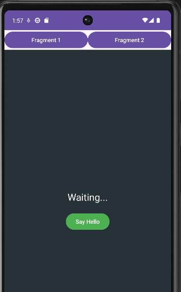
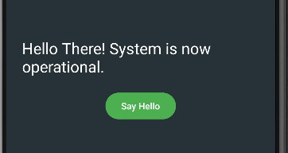
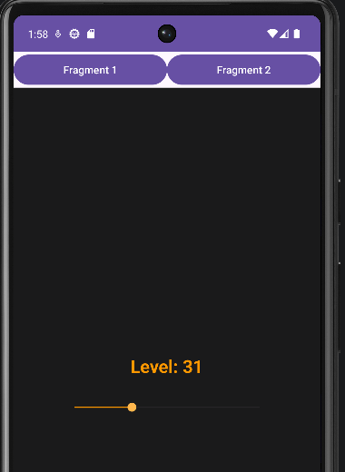
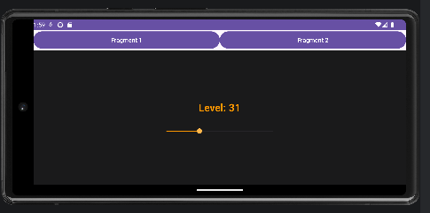

# FragmentsLab - Android Lab 4

## Fonctionnalités

- Navigation entre écrans via deux boutons sans changer d'activité.
- Gestion de la rotation : Sauvegarde automatique de la valeur de la barre (SeekBar).
- Bouton Retour : Possibilité de revenir au fragment précédent grâce à la pile (BackStack).

## Structure du projet

- MainActivity.java — Logique de remplacement des fragments et gestion des clics.
- FragmentOne.java / xml — Premier écran avec bouton d'interaction "Say Hello".
- FragmentTwo.java / xml — Deuxième écran avec SeekBar et gestion de l'état.
- activity_main.xml — Layout principal contenant les boutons et le conteneur vide (FrameLayout).

## Screenshots

Écran principal (premier fragment):

Réaction premier fragment:

Deuxième fragment:

Conservation de valeur par rotation:

